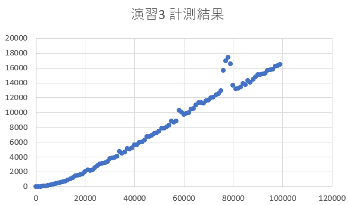
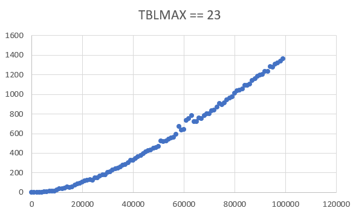
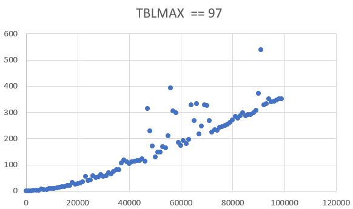
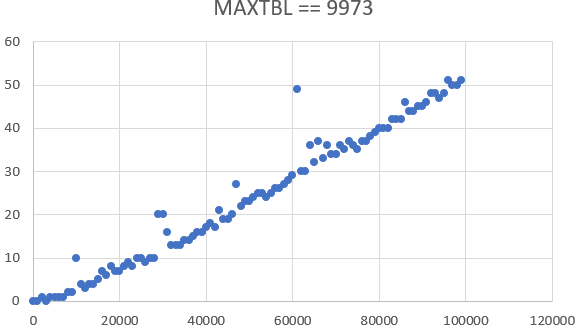
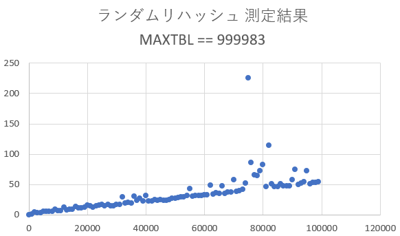

# 基礎プログラミングおよび演習レポート ＃14

学籍番号: 1810156
\
氏名: ** ***
\
ペア学籍番号・氏名(または「個人作業」): 個人作業
\
提出日付: 2019/1/27

## レポートに関する注意点等(お願い)

- 今回もマークダウン記法を多用しています。
- 見やすさを考慮し本レポートと全く同じ内容を[Githubレポジトリ](https://github.com/o1810156/fp/blob/master/L14/assignment14.md)に用意しました。もし見づらいと感じられた場合はこちらからお願いします。
- 可読性を考慮し、一部関数名を変更している場合があります。基本的にスネークケースを採用しています。
- 字数の都合上、`main`関数を含めた「プログラム全体」は表示していない場合があります。全体についてはgithubから確認できます。
- こちらで用意した入力用関数`input`を用意して使用している箇所があります。次の[GitHubレポジトリ](https://github.com/anotherhollow1125/clang_input)にある`input.c`、`input.h`を同階層にコピーして使用しております。

## [課題の再掲]

### 演習 1 構造体 color

色を与えると変化を加えた色を返す次の関数を実装する。

- a 渡された色と白の平均を取って返す関数`struct color brightered(struct color c)`
- b 渡された色と黒の平均を取って返す関数`struct color darkered(struct color c)`
- c 明るい色は暗く、暗い色は明るい色にして返す関数`struct color reversed(struct color c)`
- d Rの値をGに、Gの値をBに、Bの値をRに変換した色を返す関数`struct color GBR_color(struct color c)`とRをBに、GをRに、BをGにコピーする関数`struct color BRG_color(struct color c)`
- e 2つの色と`0.0`～`1.0`の値を渡すとその2色を指定した比率で混ぜた色を返す関数 `struct color linear_mix(struct color c, struct color d, double ratio)`
- f パラメタは何も受け取らず、中で擬似乱数でランダムな色を生成し返す関数`struct color random_color(void)`
- g [自由課題]: 与えられた色の補色を返す関数`struct color comp_color(struct color c)`

### 演習 2 構造体のポインタ

副作用により与えられた色自体を変化させる次の関数を実装する。

- a 色を明るく変化させる関数`void make_brighter(struct color *c)`
- b 演習1の`reversed`と同じ変化を施す関数`void make_reverse(struct color *c)`
- c 先の演習の`GBR_color`、`BRG_color`と同様の変化をおこなう関数`void make_GBR(struct color *c)`、`void make_BRG(struct color *c)`
- d RGB値の増分 (マイナスでもよい) を受け取り、その分だけそれぞれの成分を増やす関数`void add_color(struct color *c, int dr, int dg, int db)`
- e RGB値それぞれに`-10`～`10`の範囲のランダムな値を足すことで元とちょっとだけ違う色にする関数`void bit_differ(struct color *c)`
- f [自由課題]: 色をグレースケールにする関数`void make_gray_scale(struct color *c)`

### 演習 3 連想配列

以下を行う。

- a 登録できる値を整数1個から変更する
- b 削除機能をつける
- c 表の中身を全部まとめて表示する機能をつける
- d [自由課題]: まとめて表に値を登録する機能をつける

### 演習 4 時間計測

演習3の連想配列に関してI/Oにかかる時間を計測する。

### 演習 5 ハッシュテーブル(チェイン法)

テキストにあるハッシュテーブルについて、I/Oにかかる時間を計測し、オーダーについて検討したうえで改善策等を検討する。

### 演習 6 ハッシュテーブル(ランダム法)

ハッシュ関数2つを利用して連結リストを使用せずにハッシュテーブルを実装する。

## [実施したこととその結果]

### 演習 1 構造体 color

演習1全体を一つのファイルとした。全体の概要は以下の通りとなる。
\
また、CSSコードからも色を生成できるように`read_css_color`関数も実装した。

実行例ではCSSコード`#123456`を与えた場合を示している。

```c
#include <stdio.h>
#include <stdlib.h>
#include <string.h>
#include <time.h>
#include "input.h"

struct color { unsigned char r, g, b; };

void show_color(struct color c) {
    printf("%02x%02x%02x\n", c.r, c.g, c.b);
}

struct color mix_color(struct color c, struct color d) {
    struct color ret = { (c.r+d.r)/2, (c.g+d.g)/2, (c.b+d.b)/2 };
    return ret;
}

struct color read_color(void) {
    struct color ret;
    ret.r = atoi(input("r(0-255)> "));
    ret.g = atoi(input("g(0-255)> "));
    ret.b = atoi(input("b(0-255)> "));
    return ret;
}

struct color read_css_color(char *disc) {
    struct color res;
    char *color_code;
    while (1) {
        color_code = input("CSS color code\n%s : #", disc);
        int len = strlen(color_code);
        if (len == 3) {
            sprintf(color_code, "%c%c%c%c%c%c",
                color_code[0], color_code[0],
                color_code[1], color_code[1],
                color_code[2], color_code[2]);
        }
        if (len == 3 || len == 6) {
            char r[] = {color_code[0], color_code[1], '\0'};
            char g[] = {color_code[2], color_code[3], '\0'};
            char b[] = {color_code[4], color_code[5], '\0'};
            res.r = (unsigned char)strtol(r, NULL, 16);
            res.g = (unsigned char)strtol(g, NULL, 16);
            res.b = (unsigned char)strtol(b, NULL, 16);
            break;
        }
        printf("Wrong code, please re-input.\n");
    }

    return res;
}

// 定義部
// ... 
//

int main(void) {
    struct color white = { 255, 255, 255 };
    struct color c1 = { 10, 100, 120 };
    show_color(c1);
    show_color(mix_color(white, c1));

    struct color tmp = read_css_color("tmp");
    show_color(tmp);

    // 実行部
    // ...
    //

    return 0;
}
```

#### a brightered関数

定義部

```c
struct color brightered(struct color c) {
    return (struct color){ (c.r+255)/2, (c.g+255)/2, (c.b+255)/2 };
}
```

実行部

```c
show_color(brightered(tmp));
```

実行例

```
8899aa
```

受け取った構造体`c`の各プロパティと白の値`255`の平均値を初期値とした構造体を生成しそれを返すようにした。`(struct color){ ... }`という無理やりな書き方ができたのは正直驚きであったが、実はこの書き方の副作用に関する検証はあまりしていない。

#### b darkered関数

定義部

```c
struct color darkered(struct color c) {
    return (struct color){ c.r/2, c.g/2, c.b/2 };
}
```

実行部

```c
show_color(darkered(tmp));
```

実行例

```
091a2b
```

`brightered`関数に関して白`#ffffff`ではなく黒`#000000`と平均を取るように改変した。

#### c reversed関数

定義部

```c
struct color reversed(struct color c) {
    return (struct color){ 255 - c.r, 255 - c.g, 255 - c.b };
}
```

実行部

```c
show_color(reversed(tmp));
```

実行例

```
edcba9
```

構造体生成部のプロパティ指定を`255 - 色`とすることで実現した。

#### d GBR_color関数、BRG_color関数

定義部

```c
struct color GBR_color(struct color c) {
    return (struct color){ c.g, c.b, c.r };
}

struct color BRG_color(struct color c) {
    return (struct color){ c.b, c.r, c.g };
}
```

実行部

```c
show_color(GBR_color(tmp));
show_color(BRG_color(tmp));
```

実行例

```
345612
561234
```

今までの関数と同様に初期値を変えることで変更した。

#### e linear_mix関数

定義部

```c
struct color linear_mix(struct color c, struct color d, double ratio) {
    double t = 1 - ratio;
    return (struct color){ (int)(c.r*ratio + d.r*t), (int)(c.g*ratio + d.g*t), c.b*ratio + d.b*t };
}
```

実行部

```c
struct color c_a = read_css_color("c_a");
struct color c_b = read_css_color("c_b");
double ratio = atof(input("ratio : "));
printf("linear mix : #");
show_color(linear_mix(c_a, c_b, ratio));
```

実行例

```
CSS color code
c_a : #123456
CSS color code
c_b : #654321
ratio : 0.3
linear mix : #4c3e30
```

割合`ratio`とその割合を1から引いた値を使用して2色の重心を求め、その値を`int`型にキャストしてプロパティに指定している。

#### f random_color関数

定義部

```c
struct color random_color(void) {
    return (struct color){ (int)(rand() % 256), (int)(rand() % 256), (int)(rand() % 256) };
}
```

実行部

```c
srand(time(NULL));
struct color rdm = random_color();
show_color(rdm);
```

```
0655a3
```

`rand`関数は適当な整数値を返すので、`256`の剰余を取ることで`0`～`255`のうちからランダムな値を取得することができる。使用時は`srand(time(NULL));`で乱数を初期化してから実行する。

#### g comp_color関数

定義部

```c
struct color comp_color(struct color c) {
    int
        max = c.r,
        min = c.r,
        sum = 0;

    if (c.g > max) max = c.g;
    if (c.b > max) max = c.b;

    if (c.g < min) min = c.g;
    if (c.b < min) min = c.b;

    sum = max + min;

    return (struct color){sum - c.r, sum - c.g, sum - c.b};
}
```

実行部

```c
show_color(comp_color(tmp));
```

実行例

```
563412
```

http://appakumaturi.hatenablog.com/entry/20120121/1327143125 を参考に、補色を求める計算をさせ、結果を返すようにした。補色は`reversed`関数の結果とは異なることがわかる。

### 演習 2 構造体のポインタ

演習2全体を一つのファイルとした。全体の概要は以下の通りとなる。

実行例ではCSSコード`#123456`を最初に与えた場合を示している。

また、元の色は関数によって変更されていくため、各関数の引数は前の関数の影響を受けた色となる。

```c
#include <stdio.h>
#include <stdlib.h>
#include <string.h>
#include <time.h>
#include "input.h"

struct color { unsigned char r, g, b; };

void show_color(struct color c) {
    printf("%02x%02x%02x\n", c.r, c.g, c.b);
}

struct color read_css_color(char *disc) {
    // ... 演習1と同じ ...
}

// 定義部
// ... 
//

int main(void) {
    struct color tmp = read_css_color("");
    show_color(tmp);

    // 実行部
    // ...
    //

    return 0;
}
```

#### a make_brighter関数、make_darker関数

定義部

```c
void make_brighter(struct color *c) {
    c->r = (c->r+255)/2;
    c->g = (c->g+255)/2;
    c->b = (c->b+255)/2;
}

void make_darker(struct color *c) {
    c->r /= 2;
    c->g /= 2;
    c->b /= 2;
}
```

実行部

```c
make_brighter(&tmp);
show_color(tmp);
```

実行例

```c
8899aa
```

演習1と異なり直接引数のプロパティを変更してくこととなる。返り値は`void`となる。
\
`c`はポインタなので、`(*c).r`などと本来はアクセスするが、その糖衣構文である`c->r`のようにアクセスしている。関数の副作用により変更は保存される。

#### b make_reverse関数

定義部

```c
void make_reverse(struct color *c) {
    c->r = 255 - c->r;
    c->g = 255 - c->g;
    c->b = 255 - c->b;
}
```

実行部

```c
make_reverse(&tmp);
show_color(tmp);
```

実行例

```
776655
```

演習1cに関して演習2aに習い変更を加えた。

#### c make_GBR関数、make_BRG関数

定義部

```c
void make_GBR(struct color *c) {
    *c = (struct color){ c->g, c->b, c->r };
}

void make_BRG(struct color *c) {
    *c = (struct color){ c->b, c->r, c->g };
}
```

実行部

```c
printf("GBR : #");
make_GBR(&tmp);
show_color(tmp);
printf("BRG : #");
make_BRG(&tmp);
show_color(tmp);
```

実行例

```
GBR : #665577
BRG : #776655
```

演習1でも使用できた`(struct 型名){ ... }`という書き方を利用して構造体を生成し、それを引数のアドレスに入れるという形をとってみた。

#### d add_color関数

定義部

```c
void add_color(struct color *c, int dr, int dg, int db) {
    c->r += dr;
    c->g += dg;
    c->b += db;
}
```

実行部

```c
add_color(&tmp, 0, -10, 50);
show_color(tmp);
```

実行例

```
775c87
```

範囲外になることは、`unsigned int`型を使用していることよりとりあえず想定しなかった。他は演習2aとやっていることは変わらない。

#### e bit_differ関数

定義部

```c
void bit_differ(struct color *c) {
    c->r += (int)(rand() % 21 - 10);
    c->g += (int)(rand() % 21 - 10);
    c->b += (int)(rand() % 21 - 10);
}
```

実行部

```c
srand(time(NULL));
bit_differ(&tmp);
show_color(tmp);
```

実行例

```
775d91
```

操作については演習2aと同じで、乱数については、`rand() % 21`で`0`～`20`の値を生成し、そこから`-10`をすることで`-10`～`10`の値を生成させている。

#### f make_gray_scale関数

定義部

```c
void make_gray_scale(struct color *c) {
    unsigned char V = 0.3*c->r + 0.6*c->g + 0.1*c->b;
    c->r = V;
    c->g = V;
    c->b = V;
}
```

実行部

```c
make_gray_scale(&tmp);
show_color(tmp);
```

実行例

```
6a6a6a
```

https://qiita.com/yoya/items/96c36b069e74398796f3 の、BT.601 係数を更に粗くする を参考にし、グレースケールを生成する関数を書いた。各RGBの値がすべて`V`になっていることよりグレーであることはコードからも理解できる。

### 演習 3 連想配列

ファイルは演習3aと演習3bcdで分けた。

#### a 登録できる値の変更

演習3a全体のコードは以下の通りとなった。

`prac3a.c`

```c
#include <string.h>
#include <stdlib.h>
#include <stdbool.h>
#define MAXTBL 1000000
#ifndef MEM
#define MEM 256
#endif

struct ent {
    char *key;
    int val[MEM]; // 変更点
};

struct ent tbl[MAXTBL];
int tblsize = 0;
const int val_max_ind = MEM; // 変更点

int tbl_get(char *k, int ind) {
    if (ind < 0 || ind >= val_max_ind) return -1; // 変更点
 
    for(int i = 0; i < tblsize; ++i) {
        if(strcmp(tbl[i].key, k) == 0) return tbl[i].val[ind];
    }
    return -1;
}

bool tbl_put(char *k, int v, int ind) {
    if (ind < 0 || ind >= val_max_ind) return false; // 変更点

    for(int i = 0; i < tblsize; ++i) {
        if(strcmp(tbl[i].key, k) == 0) {
            tbl[i].val[ind] = v;
            return true;
        }
    }

    if(tblsize + 1 >= MAXTBL) return false;

    char *s = (char*)malloc(strlen(k)+1);
    if(s == NULL) return false;

    strcpy(s, k);
    tbl[tblsize].key = s;
    tbl[tblsize++].val[ind] = v; // 変更点

    return true;
}
```

`prac3a.h`

```h
#ifndef _TBL_H_
#define _TBL_H_

extern bool tbl_put(char *k, int v, int ind);
extern int tbl_get(char *k, int ind);
extern int val_max_ind;

#endif
```

`prac3a_test.c`

```c
#include <stdio.h>
#include <string.h>
#include <stdbool.h>
#include <stdlib.h>
#include "prac3a.h"
#include "input.h"
#ifndef MEM
#define MEM 256
#endif

int main(void) {
    char *b1, *b2;
    int val, ind; // 変更点
    while(true) {
        b1 = input("key (empty for quit)> ");
        if(!b1 || strlen(b1) == 0) return 0;
        b2 = input("val (-1 for query)> ");
        val = atoi(b2);
        ind = atoi(input("ind (0 ~ %d)> ", val_max_ind-1)); // 変更点
        if(val != -1) {
            tbl_put(b1, val, ind); // 変更点
        } else {
            printf("tbl[%s][%d] == %d\n", b1, ind, tbl_get(b1, ind)); // 変更点
        }
    }
}
```

実行例

```
key (empty for quit)> hoge
val (-1 for query)> 10
ind (0 ~ 255)> 0
key (empty for quit)> hoge
val (-1 for query)> 20
ind (0 ~ 255)> 1
key (empty for quit)> hoge
val (-1 for query)> -1
ind (0 ~ 255)> 0
tbl[hoge][0] == 10
key (empty for quit)> hoge
val (-1 for query)> -1
ind (0 ~ 255)> 1
tbl[hoge][1] == 20
key (empty for quit)> hoge
val (-1 for query)> -1
ind (0 ~ 255)> 2
tbl[hoge][2] == 0
key (empty for quit)>

```

構造体のプロパティ`va`を`int[MEM]`型へと変更して実装しなおした。インターフェイスに関しても少し変更を施したが、特に難なく実装することができた。

#### b 削除機能 & c 全表示機能 & d 複数登録機能

演習3b、c、d全体のコードは以下の通りとなった。

`prac3bcd.c`

```c
#include <stdio.h>
#include <string.h>
#include <stdlib.h>
#include <stdbool.h>
#include "prac3bcd.h"
#include "input.h"
#define MAXTBL 1000000

struct ent {
    char *key;
    int val;
};

struct ent tbl[MAXTBL];
int tblsize = 0;

int tbl_get(char *k) {
    for(int i = 0; i < tblsize; i++) {
        if(strcmp(tbl[i].key, k) == 0) return tbl[i].val;
    }
    return -1;
}

bool tbl_put(char *k, int v) {
    for(int i = 0; i < tblsize; i++) {
        if(strcmp(tbl[i].key, k) == 0) {
            tbl[i].val = v;
            return true;
        }
    }

    if(tblsize + 1 >= MAXTBL) return false;

    char *s = (char*)malloc(strlen(k)+1);
    if(s == NULL) return false;

    strcpy(s, k);
    tbl[tblsize].key = s;
    tbl[tblsize++].val = v;

    return true;
}

bool tbl_rm(char *k) {
    for (int i = 0; i < tblsize; i++) {
        if(strcmp(tbl[i].key, k) == 0) {
            *(tbl[i].key) = '\0';
            free(tbl[i].key);
            tbl[i].val = 0;
            for (int j = i; j < tblsize-1; j++) tbl[j] = tbl[j+1];
            tblsize--;
            return true;
        }
    }
    return false;
}

void tbl_show(void) {
    printf("key\tval\n");
    for (int i = 0; i < tblsize; i++) printf("%s\t%d\n", tbl[i].key, tbl[i].val);
}

void tbl_multi_inputs(void) {
    char *tmp = input("key val :\n");
    while (*tmp != '\0') {
        char *key = strtok(tmp, ": \t");
        int val = atoi(strtok(NULL, ": \t"));
        tbl_put(key, val);
        tmp = input("");
    }
}
```

`prac3bcd.h`

```h
#ifndef _TBL_H_
#define _TBL_H_

extern bool tbl_put(char *k, int v);
extern int tbl_get(char *k);
extern bool tbl_rm(char *k);
extern void tbl_show(void);
extern void tbl_multi_inputs(void);

#endif
```

`prac3bcd_test.c`

```c
#include <stdio.h>
#include <string.h>
#include <stdbool.h>
#include <stdlib.h>
#include "prac3bcd.h"
#include "input.h"
#ifndef MEM
#define MEM 256
#endif

int main(void) {
    char *b1, *b2;
    int val;
    while(true) {
        b1 = input("key (empty for quit)> ");
        if(!b1 || strlen(b1) == 0) return 0;
        b2 = input("val (-1:query, -2:del, -3:show, -4:multi)> ");
        val = atoi(b2);
        switch (val) {
            case -1:
                printf("tbl[%s] == %d\n", b1, tbl_get(b1));
                break;
            case -2:
                tbl_rm(b1);
                break;
            case -3:
                tbl_show();
                break;
            case -4:
                tbl_multi_inputs();
                break;
            default:
                tbl_put(b1, val);
                break;
        }
    }
}
```

実行例

```
key (empty for quit)> hoge
val (-1:query, -2:del, -3:show, -4:multi)> 10
key (empty for quit)> fuga
val (-1:query, -2:del, -3:show, -4:multi)> 20
key (empty for quit)> fuga
val (-1:query, -2:del, -3:show, -4:multi)> -2
key (empty for quit)> fuga
val (-1:query, -2:del, -3:show, -4:multi)> -1
tbl[fuga] == -1
key (empty for quit)> hoge
val (-1:query, -2:del, -3:show, -4:multi)> -4
key val :
bar     20
baz     30

key (empty for quit)> hoge
val (-1:query, -2:del, -3:show, -4:multi)> -3
key     val
hoge    10
bar     20
baz     30
key (empty for quit)>

```

#### b 削除機能

キーがマッチしたら削除処理を行い、要素を詰めてテーブルサイズを減らすことで削除機能を実装した。

#### c 全表示機能

`tblsize`の回数分、`tbl[i].key`と`tbl[i].val`を表示させるという繰り返し処理によって実現した。

#### d 複数登録機能

空行が入力されるまで、入力された値を`strtok(tmp, ": \t")`でカットしてキーと値に分割し`tbl_put(key, val)`を実行する、という風に実装することで複数の値を同時に入力可能とした。

### 演習 4 時間計測

演習3の連想配列に関してI/Oにかかる時間を計測した。結果と考察のみをここに記す。



緩やかではあるものの、2次曲線に近い曲線を描いていることより`O(N^2)`が確認できている。

また`100000`程度の大きさでも16秒もかかっており、後の演習にあるハッシュテーブルのほうが効率が良いことも確認できる。

### 演習 5 ハッシュテーブル(チェイン法)

テキストにあるハッシュテーブルに関してI/Oにかかる時間を計測した。結果と考察のみをここに記す。





このように、テーブルの容量を増やすにつれオーダーが`O(N^2)`から`O(N)`へと変化しているのが確認できた。

ただしグラフにはしなかったが、テーブルの容量があまりにも大きくなってくる(テストデータの個数も比例して大きなものになっているとする)と、このオーダーの変化を確認することができなかった。すなわち容量を大きくしても大して高速化はされなくなっていった。

このことより、連結リストをたどるよりI/Oにかかる時間のほうが圧倒的に大きくなっているのだと考察できる。

ある程度大きなテーブルならば下手に容量を大きくする必要はないということが言える。デフォルトの`9973`がその意味ではちょうどよかった。

### 演習 6 ハッシュテーブル(ランダム法)

全体のコードは以下の通りとなった。

`prac6.c`

```c
#include <stdio.h>
#include <string.h>
#include <stdlib.h>
#include <stdbool.h>
#include "prac6.h"
#include "input.h"
#define MAXTBL 999983 // 1000000以下最大の素数

struct ent {
    char *key;
    int val;
};

struct ent *tbl[MAXTBL]; // NULLを使いたいのでポインタで保存
static int _ent_num = 0;

static int hash(char *s, const int p) {
    unsigned int v = 1;
    for (;*s != '\0'; s++) v *= p * (*s) + 1;
    return (int)(v % MAXTBL);
}

static int hash1(char *s) {
    return hash(s, 11);
}

static int hash2(char *s) {
    int res = hash(s, 13);
    return res > 0 ? res % MAXTBL : 1;
}

static int lookup(char *k) {
    for (int i = hash1(k),d = hash2(k);
            tbl[i] != NULL;
            i = (i+d) % MAXTBL) {
        if (strcmp(tbl[i]->key, k) == 0) return i;
    }
    return -1;
}

int tbl_get(char *k) {
    int i = lookup(k);
    return i > 0 ? tbl[i]->val : -1;
}

bool tbl_put(char *k, int v) {
    // MAXTBL-1(== 999982)個以上格納すると検索が止まらなくなる
    if(_ent_num + 1 >= MAXTBL) return false;

    int i = lookup(k);

    if (i != -1) {
        tbl[i]->val = v;
        return true;
    }

    char *s = (char *)malloc(strlen(k)+1);
    if (s == NULL) return false;

    strcpy(s, k);

    for (int i = hash1(k),d = hash2(k); ; i = (i+d) % MAXTBL) {
        if (tbl[i] == NULL) {
            // tbl[i] = new (struct ent){ s, v };
            tbl[i] = (struct ent*)malloc(sizeof(struct ent));
            tbl[i]->key = s;
            tbl[i]->val = v;
            break;
        }
    }

    _ent_num++;
    return true;
}

bool tbl_rm(char *k) {
    int i = lookup(k);
    if (i == -1) return false;

    free(tbl[i]->key);
    tbl[i] = NULL;

    _ent_num--;
    return true;
}

void tbl_show(void) {
    printf("key\tval\n");
    for (int i = 0; i < MAXTBL; i++) {
        if (tbl[i] != NULL) printf("%s\t%d\n", tbl[i]->key, tbl[i]->val);
    }
}

void tbl_multi_inputs(void) {
    char *tmp = input("key val :\n");
    while (*tmp != '\0') {
        char *key = strtok(tmp, ": \t");
        int val = atoi(strtok(NULL, ": \t"));
        tbl_put(key, val);
        tmp = input("");
    }
}
```

`prac6.h`

```h
#ifndef _TBL_H_
#define _TBL_H_

extern bool tbl_put(char *k, int v);
extern int tbl_get(char *k);
extern bool tbl_rm(char *k);
extern void tbl_show(void);
extern void tbl_multi_inputs(void);

#endif
```

`prac6_test.c`

```c
#include <stdio.h>
#include <string.h>
#include <stdbool.h>
#include <stdlib.h>
#include "prac6.h"
#include "input.h"
#ifndef MEM
#define MEM 256
#endif

int main(void) {
    char *b1, *b2;
    int val;
    while(true) {
        b1 = input("key (empty for quit)> ");
        if(!b1 || strlen(b1) == 0) return 0;
        b2 = input("val (-1:query, -2:del, -3:show, -4:multi)> ");
        val = atoi(b2);
        switch (val) {
            case -1:
                printf("tbl[%s] == %d\n", b1, tbl_get(b1));
                break;
            case -2:
                tbl_rm(b1);
                break;
            case -3:
                tbl_show();
                break;
            case -4:
                tbl_multi_inputs();
                break;
            default:
                tbl_put(b1, val);
                break;
        }
    }
}
```

実行例

```
key (empty for quit)> hoge
val (-1:query, -2:del, -3:show, -4:multi)> 10
key (empty for quit)> fuga
val (-1:query, -2:del, -3:show, -4:multi)> 20
key (empty for quit)> hoge
val (-1:query, -2:del, -3:show, -4:multi)> -2
key (empty for quit)> bar
val (-1:query, -2:del, -3:show, -4:multi)> 30
key (empty for quit)> hoge
val (-1:query, -2:del, -3:show, -4:multi)> -3
key     val
bar     30
fuga    20
key (empty for quit)> hoge
val (-1:query, -2:del, -3:show, -4:multi)> -4
key val :
hoge    10
bar     50
baz     40

key (empty for quit)> hoge
val (-1:query, -2:del, -3:show, -4:multi)> -3
key     val
hoge    10
bar     50
baz     40
fuga    20
key (empty for quit)>
```

ハッシュについては`hash`関数を用意し、さらにそれをラップした関数`hash1`、`hash2`を用意して2つとした。`d = hash2(k)`の結果が`d == 0 || d == MAXTBL`となってしまう時、無限ループに陥ってしまうため、`hash2`に関してはそうならないような工夫を施すこととした。

またはじめ`tbl[i] = (struct ent*)malloc(sizeof(struct ent));`の部分を特に注意することなく`struct ent p; ...; tbl[i] = &p;`のようにしてしまったところ、関数から抜けたのちに挙動が不安定となってしまったことから、構造体に関してもスコープがあり、スコープの影響を消すために`malloc`関数を使用しなければならないということに気が付いた。

実行例からも確認できるように、このハッシュテーブルに関して、順番は保存されないことが確認できる。この挙動は(古い)Pythonなどの連想配列にも当てはまる。

測定結果は以下のようになった。



(ほぼ)連結リストによるハッシュテーブルと同様の結果となった。無駄なくメモリを使いたい場合はよい実装といえるが、最大値に関係なく使用したいときなどを考えると、わざわざランダムリハッシュを使用する必要性は薄いと考えられる。

## [考察]

今回はRubyでも使用した構造体とそれを利用した連想配列、さらにはハッシュ関数を用いた重要なデータ構造であるハッシュテーブルに関して取り組んだ。

動作原理はなんとなく知っていても、ハッシュ関数が満たさなければならない条件を確認できたり、使用規模に見合った実装がどんなものであるかを計測から確かめられたりなど、実際に手を動かすことで得られたものがあったのは良かった。

特に自分はJ科のセキュリティプログラム志望なので、ハッシュ関数に関しては機会があればまた自分でも学びなおしたいと思う。

## [アンケート]

- Q1. 構造体を使ったプログラムが書けるようになりましたか。

Rubyのときと大差なかったというのが正直な感想ですが、スコープに関して注意が必要であることが分かったのは良かったです。

- Q2. 表と検索とはどういうことか理解しましたか。

他の高級言語で当たり前に使用していた機能の内側を知ることができ良かったです。

- Q3. リフレクション(今回の課題で分かったこと)・感想・要望をどうぞ。

次回で最後、テスト等で忙しくなってきていますが、頑張りたいと思います!