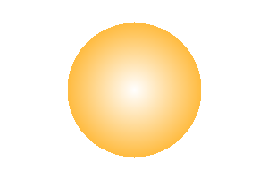

# 基礎プログラミングおよび演習レポート ＃05

学籍番号: 1810156
\
氏名: ** ***
\
ペア学籍番号・氏名(または「個人作業」): 個人作業
\
提出日付: 2018/11/5

## レポートに関する注意点等(お願い)

- 今回もマークダウン記法を多用しています。
- 見やすさを考慮し本レポートと全く同じ内容を[Githubレポジトリ](https://github.com/o1810156/fp/blob/master/L5/assignment5.md)に用意しました。もし見づらいと感じられた場合はこちらからお願いします。
- **特に今回は作成した画像の相対パスを実行結果として載せており、画像はGithubレポジトリにあるレポートより実際に見ることが可能です。** 逆に言うとプレーンテキストにおいては`実行結果↓`以降はまったく意味をなしていません。

## [課題の再掲]

### 演習 1 基本的な図形の作成

- a: 垂直または斜め (右上がり) に線を引くようにしてみる。
- b: 幅3以上の線を引くようにしてみる
- c: 線を複数使って、長方形とか正方形を描く。
- d: 長方形や正方形の中を塗りつぶす。
- e: 三角形を描いてみる。
- f: その他、好きな図形や模様や色を表現してみる。

### 演習 2 円を用いた模様の生成

- a: 蛇の目状に円を配置する。
- b: 縦2×横2で正方形状に円を配置する。
- c: 右肩下がりの直線上に円を4つ配置する。
- d: 段々小さくなっていくように円を5つ横に並べる。

### 演習 3 円以外の図形を作成してみる

- a: ドーナツ型を塗るメソッド。
- b: 長方形または楕円を塗るメソッド。
- c: 三角形を塗るメソッド。
- d: その他、自分の好きな形を塗るメソッド。

### 演習 4 模様やその他機能の実装

- a: 2色を指定して、ストライプ、ボーダー、チェックなどで塗れるようにする。
- b: 色を塗る際に、「重ね塗り」できるようにする。つまり透明度 (transparency)0 ≤ t < 1 を指定し、各 R/G/B 値について単に新しい値で上書きする代わりに t × cold + (1− t)× cnewのように混ぜ合わせた値にする。
- c: 徐々に色調が変わっていくようにする。
- d: ぼやけた形、ふわっとした形などを表現してみる。
- e: その他、美しい絵を描くのにあるとよい機能を工夫して実装する。

### 演習 5 好きな絵を生成する

演習1～演習4までの内容を応用して好きな絵を生成する。

## [実施したこととその結果]

演習に取り組む前に、グローバル変数に画像の状態を保存する形式は避けたかったので、テキストの内容をもとにクラスを作成した。インスタンスに画像状態を保存する方法ならば、キャンバスのサイズも適宜任意の値にでき非常に便利である。

```ruby
Pixel = Struct.new(:r, :g, :b)

class Image
    def initialize(width, height)
        @width = width
        @height = height
        @canvas = Array.new(height) do
            Array.new(width) do
                Pixel.new(255, 255, 255)
            end
        end
    end

    attr_accessor :width, :height

    def pset(x, y, r, g, b)
        if !(0 <= x and x < @width and 0 <= y and y < @height)
            raise ArgumentError.new "Please pass arguments having proper range."
        end

        @canvas[y][x] = Pixel.new(r, g, b)
    end

    def write2ppm(name)
        if !(name =~ /.*\.ppm$/) then name += ".ppm" end
        open(name, "wb") do |f|
            f.puts("P6\n#{@width} #{@height}\n255")
            @canvas.each do |a|
                a.each do |p|
                    f.write(p.to_a.pack("ccc"))
                end
            end
        end
    end
end
```

1ピクセルの情報を保持する構造体`Pixel`と、画像を扱うクラス`Image`を定義した。

- `img = Image.new(幅、高さ)`でインスタンス化
- `img.pset(x, y, 赤, 緑, 青)`で、座標`(x, y)`に`(赤, 緑, 青)`をプロット
- `img.write2ppm`で`ppm`フォーマット画像を保存

このクラスを読み込んだうえで各演習に取り組んだ。

### 演習 1 基本的な図形の作成

各問題を実行するコードは`prac1.rb`としてまとめており、プログラムの先頭に以下のコードを記述している。

```ruby
load "pict.rb"
PATH="prac1_pics/"
```

#### a 斜め右上に線を引く

縦横に同じ値`x`を指定する操作を繰り返すと斜め右下の直線となる。

```ruby
img_a = Image.new(200, 200)
for x in 0..199
    img_a.pset(x, x, 0, 255, 0)
end
img_a.write2ppm(PATH+"p_a.ppm")
```

実行結果↓


今回の場合、斜め右上とするには`y`座標を`199-x`と指定すればよい。

```ruby
img_a2 = Image.new(200, 200)
for x in 0..199
    img_a2.pset(x, 199-x, 0, 255, 0)
end
img_a2.write2ppm(PATH+"p_a2.ppm")
```

実行結果↓


#### b 指定した幅の線を引く

高さに関して線の幅の分繰り返しを指定すればいい。

```ruby
def line_n(n)
    img = Image.new(300, 200)
    80.step(119) do |x|
        for y in (80-n/2)..(80+(n+1)/2)-1
            img.pset(x, y, 255, 255, 0)
        end
    end
    img.write2ppm(PATH+"p_b_line_#{n}.ppm")
end

line_n(2)
line_n(3)
line_n(4)
line_n(5)
```

実行結果(幅3のみ)↓


#### c 長方形や正方形を描く

横に延びる辺と縦に延びる辺で分けてループさせて描いた。

```ruby
img_c = Image.new(300, 200)
130.step(169) do |x|
    img_c.pset(x, 80, 255, 0, 0)
    img_c.pset(x, 119, 255, 0, 0)
end
80.step(119) do |y|
    img_c.pset(130, y, 255, 0, 0)
    img_c.pset(169, y, 255, 0, 0)
end
img_c.write2ppm(PATH+"p_c.ppm")
```

実行結果↓


#### d cについて中を塗りつぶす

cとは逆に、分けずに2重ループとすることで塗りつぶした正方形とした。

```ruby
img_d = Image.new(300, 200)
130.step(169) do |x|
    80.step(119) do |y|
        img_d.pset(x, y, 0, 255, 0)
    end
end
img_d.write2ppm(PATH+"p_d.ppm")
```

実行結果↓


#### e 三角形を描いてみる

直角三角形などが描けるだけでは面白くないので、3点を与えるとその3点で三角形を作るコードにした。
\
3点より与えられる線分3本に関して傾きを求め、各線分の外周を繰り返しで描く、という方法を取った。なお0割り(傾き`∞`、あるいは`x = a`のような形であらわされる線分)に関しては考慮していない。

塗りつぶしには少し工夫を施した。線分で2領域に分けられることを利用し、三角形の重心側の領域には`+1`を、そうでない領域には`-1`をし、`2`以上になっている領域を塗りつぶす領域とみなして、画面全体に繰り返し処理を掛けて描写した。(そのため場合によってはすごく遅い処理となる。)

```ruby
def triangle_img(p_a, p_b, p_c, fill=false, color=Pixel.new(0, 0, 0))
    if color.class != Pixel then raise ArgumentError.new "color must be Pixel." end
    [p_a, p_b, p_c].each do |p|
        if (p.class != Array or p.length != 2 or
                p[0] < 0 or 300 <= p[0]
                p[1] < 0 or 200 <= p[1]) then
            return
        end
    end
    img = Image.new(300, 200)
    ab_coef = (p_a[1] - p_b[1]) / (p_a[0] - p_b[0]).to_f
    ab = {
        :line => lambda {|x| ab_coef*(x - p_a[0]) + p_a[1]},
        :range => [p_a[0], p_b[0]]
    }

    bc_coef = (p_b[1] - p_c[1]) / (p_b[0] - p_c[0]).to_f
    bc = {
        :line => lambda {|x| bc_coef*(x - p_b[0]) + p_b[1]},
        :range => [p_b[0], p_c[0]]
    }

    ca_coef = (p_c[1] - p_a[1]) / (p_c[0] - p_a[0]).to_f
    ca = {
        :line => lambda {|x| ca_coef*(x - p_c[0]) + p_c[1]},
        :range => [p_c[0], p_a[0]]
    }

    if fill
        x_center = (p_a[0]+p_b[0]+p_c[0]) / 3.0
        y_center = (p_a[1]+p_b[1]+p_c[1]) / 3.0
        field = Array.new(img.height) do
            Array.new(img.width, 0)
        end
        [ab, bc, ca].each do |pp|
            t = pp[:line].call(x_center) < y_center ? 1 : -1

            h_x, l_x = pp[:range][0] > pp[:range][1] ? [pp[:range][0], pp[:range][1]] : [pp[:range][1], pp[:range][0]]
            l_x.step(h_x) do |x|
                l_y = pp[:line].call(x).to_i
                l_y = l_y < 0 ? 0 : l_y >= img.height ? img.height : l_y
                l_y.times do |y|
                    # puts "(#{x}, #{y})"
                    field[y][x] -= t
                end
                l_y.step(img.height-1) do |y|
                    # puts "(#{x}, #{y})"
                    field[y][x] += t
                end
            end
        end
        field.each_with_index do |a, y|
            a.each_with_index do |b, x|
                if b >= 2 then img.pset(x, y, color.r, color.g, color.b) end
            end
        end
    end
    [ab, bc, ca].each do |pp|
        h_x, l_x = pp[:range][0] > pp[:range][1] ? [pp[:range][0], pp[:range][1]] : [pp[:range][1], pp[:range][0]]
        l_x.step(h_x) do |x|
            img.pset(x, pp[:line].call(x).to_i, color.r, color.g, color.b)
        end
    end

    img.write2ppm(PATH+"p_e_#{p_a[0]}-#{p_a[1]}_#{p_b[0]}-#{p_b[1]}_#{p_c[0]}-#{p_c[1]}.ppm")
end

# とりあえず0割り除算等は考慮しない
triangle_img([100, 50], [50, 100], [200, 150], fill=true, color=Pixel.new(255, 255, 0))
triangle_img([30, 150], [150, 20], [234, 111], fill=false, color=Pixel.new(0, 0, 255))
triangle_img([50, 50], [100, 100], [200, 199], fill=false, color=Pixel.new(0, 255, 0))
```

実行結果(一部抜粋)↓


#### f [自由課題]: ポリゴン

eをポリゴンに対応させてみた。傾きが∞になる線分にも対応させた。
\
基本的な仕組みはほぼ同等である。

```ruby
def polygon_img(ps, fill=false, color=Pixel.new(0, 0, 0), name="poly")
    if color.class != Pixel then raise ArgumentError.new "color must be Pixel." end
    if ps.class != Array then raise ArgumentError.new "ps must be Array." end
    ps.each do |p|
        if (p.class != Array or p.length != 2 or
                p[0] < 0 or 300 <= p[0]
                p[1] < 0 or 200 <= p[1]) then
            raise ArgumentError.new "ps must have 2 length Array."
        end
    end
    img = Image.new(300, 200)

    pps = Array.new(ps.length) do |i| # pps は point point s の略 eで言う a b のような直線の集合
        j = (i+1) % ps.length
        if ps[i][0] == ps[j][0]
            f = lambda{|x| return "Infinity"}
            r = [ps[i][1] < ps[j][1] ? [ps[i][1], ps[j][1]] : [ps[j][1], ps[i][1]], ps[i][0]]
        else
            coef = (ps[i][1] - ps[j][1]) / (ps[i][0] - ps[j][0]).to_f
            f = lambda {|x| coef*(x - ps[i][0]) + ps[i][1]}
            r = ps[i][0] < ps[j][0] ? [ps[i][0], ps[j][0]] : [ps[j][0], ps[i][0]]
        end
        {
            :line => f,
            :range => r
        }
    end

    if fill
        x_center = (ps.inject(0) {|s, _p| s + _p[0]}) / ps.length.to_f
        y_center = (ps.inject(0) {|s, _p| s + _p[1]}) / ps.length.to_f
        field = Array.new(img.height) do
            Array.new(img.width, 0)
        end
        pps.each do |pp|
            if pp[:line].call(10) != "Infinity"
                t = pp[:line].call(x_center) < y_center ? 1 : -1

                pp[:range][0].step(pp[:range][1]) do |x|
                    l_y = pp[:line].call(x).to_i # l_y <= line y
                    l_y = l_y < 0 ? 0 : l_y >= img.height ? img.height : l_y
                    l_y.times do |y|
                        field[y][x] -= t
                    end
                    l_y.step(img.height-1) do |y|
                        field[y][x] += t
                    end
                end
            else
                l_x = pp[:range][1]
                t = l_x < x_center ? 1 : -1

                pp[:range][0][0].step(pp[:range][0][1]) do |y|
                    l_x.times do |x|
                        field[y][x] -= t
                    end
                    l_x.step(img.width-1) do |x|
                        field[y][x] += t
                    end
                end
            end
        end
        field.each_with_index do |a, y|
            a.each_with_index do |b, x|
                if b >= 2 then img.pset(x, y, color.r, color.g, color.b) end
            end
        end
    end
    pps.each do |pp|
        if pp[:line].call(10) != "Infinity"
            pp[:range][0].step(pp[:range][1]) do |x|
                img.pset(x, pp[:line].call(x).to_i, color.r, color.g, color.b)
            end
        else
            pp[:range][0][0].step(pp[:range][0][1]) do |y|
                img.pset(pp[:range][1], y, color.r, color.g, color.b)
            end
        end
    end

    img.write2ppm(PATH+"p_f_#{name}.ppm")
end

polygon_img([[150, 50] \
            ,[(150-50*(Math::sqrt(3)/(2.to_f))).to_i, 75] \
            ,[(150-50*(Math::sqrt(3)/(2.to_f))).to_i, 125] \
            ,[150, 150] \
            ,[(150+50*(Math::sqrt(3)/(2.to_f))).to_i, 125] \
            ,[(150+50*(Math::sqrt(3)/(2.to_f))).to_i, 75] \
        ], fill=true, color=Pixel.new(0, 255, 255), name="hexagon")

def rotate(p0, center, theta)
    pos = [0, 1].map do |i| p0[i] - center[i] end
    return [Math::cos(theta)*pos[0]-Math::sin(theta)*pos[1]+center[0],
            Math::sin(theta)*pos[0]+Math::cos(theta)*pos[1]+center[1]]
end

pentagon = []
p0 = [150, 50]
center = [150, 100]
pentagon.push(p0)
for i in 1..4
    x, y = rotate(p0, center, (2*Math::PI*i)/5.0).map do |t| t.to_i end
    pentagon.push([x, y])
end

points = [0, 2, 4, 1, 3].map do |i| pentagon[i] end
polygon_img(points, fill=true, color=Pixel.new(255, 255, 0), name="star")
```

実行結果↓

- `p_f_hexagon.ppm`


- `p_f_star.ppm`


### 演習 2 円を用いた模様の生成

各問題を実行するコードは`prac2.rb`としてまとめており、プログラムの先頭に以下のコードを記述している。

```ruby
load "pict.rb"
PATH = "prac2_pics/"
```

なお、以下に示すように、`fill_circle`よりも拡張性が高い`fill`関数を実装し、さらに`fill_circle`メソッドを実装した。このコードも先頭に書いてある。

`fill`関数は判定が`true`のピクセルである時に色を塗るメソッドである。

```ruby
class Image
    def fill(center=[0, 0], color=Pixel.new(0, 0, 0), &f)
        @height.times do |y|
            @width.times do |x|
                if yield(x-center[0], y-center[1]) then pset(x, y, color.r, color.g, color.b) end
            end
        end
    end
end

def fill_circle(img, x0, y0, rad, r, g, b)
    img.fill([x0, y0], color=Pixel.new(r, g, b)) { |x, y|
        x**2 + y**2 <= rad**2
    }
end

img_exCircle = Image.new(300, 200)
fill_circle(img_exCircle, 110, 100, 60, 255, 0, 0)
fill_circle(img_exCircle, 180, 120, 40, 100, 200, 80)
img_exCircle.write2ppm(PATH+"exCircle.ppm")
```

#### a 蛇の目状に円を配置する

3つ円を中心を同じにして配置しただけである。

```ruby
img_a = Image.new(200, 200)
fill_circle(img_a, 100, 100, 60, 255, 0, 0)
fill_circle(img_a, 100, 100, 40, 0, 255, 0)
fill_circle(img_a, 100, 100, 20, 0, 0, 255)
img_a.write2ppm(PATH+"p_a.ppm")
```

実行結果↓


#### b 縦2×横2で正方形状に円を配置する

繰り返し処理で4つ円を描いた。

```ruby
img_b = Image.new(200, 200)
[-25, 25].each do |dy|
    [-25, 25].each do |dx|
        fill_circle(img_b, 100+dx, 100+dy, 25, 0, 0, 255)
    end
end
img_b.write2ppm(PATH+"p_b.ppm")
```

実行結果↓


#### c 右肩下がりの直線上に円を4つ配置する

左上が`(0, 0)`であるから、`x`、`y`の値を同一にして4点で繰り返せばよい。

```ruby
img_c = Image.new(200, 200)
[25, 75, 125, 175].each do |x|
    fill_circle(img_c, x, x, 25, 0, 0, 255)
end
img_c.write2ppm(PATH+"p_c.ppm")
```

実行結果↓


#### d 段々小さくなっていくように円を5つ横に並べる

`y`座標を固定して、中心を示す変数`p`と半径を示す変数`r`を変化させることでプロットした。

```ruby
img_d = Image.new(300, 200)
p = 0
[50, 40, 30, 20, 10].each do |r|
    p += r
    fill_circle(img_d, p, 100, r, 255, 0, 255)
    p += r
end
img_d.write2ppm(PATH+"p_d.ppm")
```

実行結果↓


### 演習 3 円以外の図形を作成してみる

各問題を実行するコードは`prac3.rb`としてまとめており、プログラムの先頭に以下のコードを記述している。

```ruby
load "pict.rb"
PATH = "prac3_pics/"
```

なお演習2で示した`fill`関数を演習3でも定義している。(同一であるためコードは省略)

#### a ドーナツ型を塗るメソッド

「内半径より大きく外半径より小さい範囲」で`true`を返すブロックを渡すことで`fill_donut`ができる。

```ruby
def fill_donut(img, x0, y0, in_rad, ex_rad, r, g, b)
    img.fill([x0, y0], color=Pixel.new(r, g, b)) { |x, y|
        x**2 + y**2 <= ex_rad**2 and x**2 + y**2 > in_rad**2
    }
end

img_a = Image.new(200, 200)
fill_donut(img_a, 100, 100, 25, 50, 115, 66, 41)
img_a.write2ppm(PATH+"p_a.ppm")
```

実行結果↓


#### b 長方形または楕円を塗るメソッド

##### 長方形

長方形の範囲内であるかを返すブロックを定義しただけである。

```ruby
def fill_rect(img, x_s, y_s, x_g, y_g, r, g, b)
    img.fill([0, 0], color=Pixel.new(r, g, b)) { |x, y|
        x_s <= x and x <= x_g and y_s <= y and y <= y_g
    }
end

img_b_rect = Image.new(300, 200)
fill_rect(img_b_rect, 50, 50, 250, 150, 0, 0, 255)
img_b_rect.write2ppm(PATH+"p_b_rect.ppm")
```

実行結果↓


##### 楕円

数学的定義`x^2/a^2 + y^2/b^2 = 1`に基づいてブロックを定義した。

```ruby
def fill_ellipse(img, x0, y0, xr, yr, r, g, b)
    img.fill([x0, y0], color=Pixel.new(r, g, b)) { |x, y|
        (x**2 / (xr**2).to_f) + (y**2 / (yr**2).to_f) <= 1
    }
end

img_b_ellipse = Image.new(300, 200)
fill_ellipse(img_b_ellipse, 150, 100, 100, 50, 255, 0, 0)
img_b_ellipse.write2ppm(PATH+"p_b_ellipse.ppm")
```

実行結果↓


#### c 三角形を塗るメソッド

ある意味で演習1のリファクタリングである。2つの一次独立なベクトル`v1`、`v2`に関して、`t*v1 + u*v2 (t, uは正、t + u = 1)`が三角形に含まれる座標である。座標から`t`、`u`の値を逆行列を利用して算出し、条件に合うかを判断するブロックを定義した。

```ruby
def fill_triangle(img, p1, p2, p3, r, g, b)
    ps = [p1, p2, p3]
    if ps.any? {|p| p.class != Array or p.length != 2} then raise ArgumentError.new "Points must be 2 length Array." end
    if p1 == p2 or p2 == p3 or p3 == p1 then raise ArgumentError.new "Duplication of points is exist there." end
    # ベクトルで考える。
    v1 = [p2[0] - p1[0], p2[1] - p1[1]]
    v2 = [p3[0] - p1[0], p3[1] - p1[1]]
    deno = (v1[0]*v2[1] - v1[1]*v2[0]).to_f
    if deno == 0 then
        raise ArgumentError.new "deno=0\n指定方法を変えてみて下さい。"
    end
    rev = [[v2[1]/deno, -v2[0]/deno], [-v1[1]/deno, v1[0]/deno]]
    img.fill([p1[0], p1[1]], color=Pixel.new(r, g, b)) { |x, y|
        t = rev[0][0]*x + rev[0][1]*y
        u = rev[1][0]*x + rev[1][1]*y
        t >= 0 and u >= 0 and t + u <= 1
    }
end

img_c = Image.new(300, 200)
fill_triangle(img_c, [100, 50], [50, 100], [200, 150], 255, 255, 0)
img_c.write2ppm(PATH+"p_c.ppm")
```

実行結果↓


#### d [自由課題]: 正n角形を描く

三角形に分割すれば塗ることができることを利用し、正n角形を描くメソッドを定義してみた。

各頂点は回転行列

```
[[cosθ, -sinθ],
 [sinθ,  cosθ]]
```

を用いて以下のコードで算出した。

```ruby
        tmp_p = [Math::cos(theta)*pos[0]-Math::sin(theta)*pos[1]+center[0],
                 Math::sin(theta)*pos[0]+Math::cos(theta)*pos[1]+center[1]]
```

全体は以下のようになる。

```ruby
def fill_reg_polygon(img, n, center, p0, r, g, b)
    if center.class != Array or center.length != 2 then return end
    if p0.class != Array or p0.length != 2 then return end

    theta = (2*Math::PI)/(n.to_f)
    tmp_p = p0
    ps = Array.new(n-1) {
        pos = Array.new(2) {|i| tmp_p[i]-center[i]}
        tmp_p = [Math::cos(theta)*pos[0]-Math::sin(theta)*pos[1]+center[0],
                 Math::sin(theta)*pos[0]+Math::cos(theta)*pos[1]+center[1]]
        [tmp_p[0].to_i, tmp_p[1].to_i]
    }
    ps.insert(0, [p0[0].to_i, p0[1].to_i])
    (n-2).times do |i|
        fill_triangle(img, ps[0], ps[i+1], ps[i+2], r, g, b)
    end
end

img_d = Image.new(3000, 2000)
fill_reg_polygon(img_d, 8, [1500, 1000], [1500-500/(Math::tan((3/8.0)*Math::PI)), 500], 255, 165, 0)
img_d.write2ppm(PATH+"p_d.ppm")
```

実行結果↓

<!--  -->


### 演習 4 模様やその他機能の実装

各問題を実行するコードはそれぞれ`prac4_a.rb`、`prac4_b.rb`、`prac4_c.rb`、`prac4_d.rb`としてまとめており、それぞれのプログラムの先頭に以下のコードを記述している。

```ruby
load "prac4.rb"
```

なお、演習4を実施するにあたり、"pict.rb"を根本的に改良し、alphaチャンネルに対応させたクラス`Image_alpha`を定義した。以下に示す`pict_alpha.rb`をさらに次に示す`prac4.rb`で読み込んでいる。

`pict_alpha.rb`↓

```ruby
load "pict.rb"

Pixel_alpha = Struct.new(:r, :g, :b, :alpha)

class Image
    def draw_alpha_layer(layer)
        if @width != layer.width or @height != layer.height then raise ArgumentError.new "サイズが合いません。" end
        if layer.class != Image_alpha then raise ArgumentError.new "layer must be Image_alpha." end

        base = Image_alpha.new(@width, @height)
        base.canvas = base.canvas.map {|row|
            row.map {|c|
                Pixel_alpha.new(255, 255, 255, 1)
            }
        }
        layer = base + layer

        layer.canvas.map.with_index do |row, y|
            row.map.with_index do |pix, x|
                # @canvas[y][x] = Pixel.new(*([pix.r, pix.g, pix.b].map {|c| (c*(1 - pix.alpha)).to_i}))
                @canvas[y][x] = Pixel.new(pix.r, pix.g, pix.b)
            end
        end
    end
end

class Image_alpha
    def initialize(width, height)
        @width = width
        @height = height
        @canvas = Array.new(height) do
            Array.new(width) do
                Pixel_alpha.new(255, 255, 255, 0)
            end
        end
    end

    attr_accessor :width, :height, :canvas

    def pset(x, y, r, g, b, alpha=1)
        if !(0 <= x and x < @width and 0 <= y and y < @height)
            raise ArgumentError.new "Please pass arguments having proper range."
        end
        if alpha < 0 or 1 < alpha
            puts "alpha: #{alpha}"
            raise ArgumentError.new "Please pass proper alpha channel [0, 1]."
        end

        @canvas[y][x] = Pixel_alpha.new(r, g, b, alpha)
    end

    # 演習 4 e 美しい絵を描くのにあると良い機能 : Layer機能(blendやride!など)
    # 演習 4 b 「重ね塗り」できるようにする : blend機能

    # [wikipedia](https://ja.wikipedia.org/wiki/%E3%82%A2%E3%83%AB%E3%83%95%E3%82%A1%E3%83%96%E3%83%AC%E3%83%B3%E3%83%89)によると
    
    # out_A = src_A + dst_A * (1 - src_A)
    # out_rgb = out_A != 0 ? (src_rgb * src_A + dst_rgb * dst_A * (1 - src_A)) / out_A : 0

    # という計算式でαブレンドができる。

    def blend(other)
        if @width != other.width or @height != other.height then raise ArgumentError.new "サイズが合いません。" end

        o = other.canvas # src
        c = @canvas # dst

        canvas = c.map.with_index {|row, y|
            row.map.with_index {|pix, x|
                alpha = o[y][x].alpha + pix.alpha * (1 - o[y][x].alpha)
                rgb = [:r, :g, :b].map {|col|
                    res = alpha != 0 ? (o[y][x][col] * o[y][x].alpha + pix[col] * pix.alpha * (1 - o[y][x].alpha))/alpha : 0
                    res.to_i
                }
                Pixel_alpha.new(*rgb, alpha)
            }
        }
        tmp = Image_alpha.new(@width, @height)
        tmp.canvas = canvas
        return tmp
    end

    def +(other)
        return blend(other)
    end

    def ride!(other, bx, by)
        o = other.canvas # src
        c = @canvas # dst

        o.each_with_index {|row, y|
            y += by
            row.each_with_index {|pix, x|
                x += bx
                alpha = pix.alpha + c[y][x].alpha * (1 - pix.alpha)
                rgb = [:r, :g, :b].map {|col|
                    res = alpha != 0 ? (pix[col] * pix.alpha + c[y][x][col] * c[y][x].alpha * (1 - pix.alpha))/alpha : 0
                    res.to_i
                }
                c[y][x] = Pixel_alpha.new(*rgb, alpha)
            }
        }
    end

    def write2ppm(name)
        img = Image.new(@width, @height)
        img.draw_alpha_layer(self)
        img.write2ppm(name)
    end
end
```

3つのメソッドを追加した。これらが演習4b、eなどに当たる。

- `Image::draw_alpha_layer`メソッド: `Image_alpha`クラスのインスタンスを`Image`クラスのインスタンスに固定する。このメソッドを通すことで`Image_alpha`クラスのインスタンスを`ppm`画像として保存できる。
- `Image_alpha::blend`(`+`)メソッド: `Image_alpha`クラスのインスタンスを透明度の法則に従ってブレンドする。`img1 + img2`のように書くのは`img1.blend(img2)`に等しく、`img1`の上に`img2`を重ねる。
- `Image_alpha::ride!`メソッド: `blend`メソッドはサイズの等しい画像同士でないとブレンドできないが、`ride!`メソッドは大きい画像(メソッドを呼び出されたインスタンス)に小さい画像(引数として渡されるインスタンス)を乗せることができる破壊的メソッドである。このメソッドを使用することで画像生成の時間を減らすことが可能になる。

`prac4.rb`↓

```ruby
load "pict_alpha.rb"
PATH = "prac4_pics/"

class Image_alpha
    def fill(center=[0, 0], filter=lambda{|x, y| Pixel_alpha.new(0, 0, 0, 1)}, &f) # filterを受け取れるようにした。
        @height.times do |y|
            @width.times do |x|
                if yield(x-center[0], y-center[1])
                    color = filter.call(x, y)
                    if color.class == Pixel_alpha
                        pset(x, y, color.r, color.g, color.b, color.alpha)
                    elsif color.class == Pixel
                        pset(x, y, color.r, color.g, color.b)
                    elsif color.class == Array
                        if color.length == 4
                            pset(x, y, color[0], color[1], color[2], color[3])
                        elsif color.length == 3
                            pset(x, y, color[0], color[1], color[2])
                        end
                    end
                end
            end
        end
    end
end

# 以下演習3の該当範囲とほぼ同じであるので省略する。
# ==== fill_OO ====

# ~~ 省略 ~~

# ==== ####### ====
```

prac3の関数群を定義しなおした。ここで模様も設定できるようにした。

模様はブロックで渡す。ブロックの引数は座標、返り値は色(`Pixel`または`Pixel_alpha`)である。

#### a 2色を指定して、ストライプ、ボーダー、チェックなどで塗れるようにする

`prac4.rb`で定義した関数に合うようにフィルターブロックを作成した。

```ruby
load "prac4.rb"

filters = {
    "stripe" => lambda {|x, y|
        ((x / 5) % 2) == 0 ? Pixel.new(255, 255, 0) : Pixel.new(255, 255, 255)
    },
    "border" => lambda {|x, y|
        ((y / 5) % 2) == 0 ? Pixel.new(0, 255, 255) : Pixel.new(255, 255, 255)
    },
    "check" => lambda {|x, y|
        (((x / 5)+(y / 5)) % 2) == 1 ? Pixel.new(0, 0, 0) : Pixel.new(255, 255, 255)        
    }
}

filters.each {|key, filter|
    img_a = Image_alpha.new(200, 200)
    fill_donut(img_a, 100, 100, 25, 50, filter)
    img_a.write2ppm(PATH+"#{key}/p_a.ppm")

    img_b_rect = Image_alpha.new(300, 200)
    fill_rect(img_b_rect, 50, 50, 250, 150, filter)
    img_b_rect.write2ppm(PATH+"#{key}/p_b_rect.ppm")

    img_b_ellipse = Image_alpha.new(300, 200)
    fill_ellipse(img_b_ellipse, 150, 100, 100, 50, filter)
    img_b_ellipse.write2ppm(PATH+"#{key}/p_b_ellipse.ppm")

    img_c = Image_alpha.new(300, 200)
    fill_triangle(img_c, [100, 50], [50, 100], [200, 150], filter)
    img_c.write2ppm(PATH+"#{key}/p_c.ppm")

    img_d = Image_alpha.new(3000, 2000)
    fill_reg_polygon(img_d, 8, [1500, 1000], [1500-500/(Math::tan((3/8.0)*Math::PI)), 500], filter)
    img_d.write2ppm(PATH+"#{key}/p_d.ppm")
}
```

実行結果(一部抜粋)↓

- 三角形 + stripe


- 正八角形 + border

<!--  -->


- 楕円 + 市松模様

<!--  -->


#### b 色を塗る際に、「重ね塗り」できるようにする

実装したコードは上記に示したので、ここでは機能を試してみた。

```ruby
load "prac4.rb"

img_r = Image_alpha.new(300, 200)
fill_circle(img_r, 150, 70, 50, lambda {|x, y| Pixel_alpha.new(255, 0, 0, 1)})
img_g = Image_alpha.new(300, 200)
fill_circle(img_g, 124, 115, 50, lambda {|x, y| Pixel_alpha.new(0, 225, 0, 1)})
img_b = Image_alpha.new(300, 200)
fill_circle(img_b, 176, 115, 50, lambda {|x, y| Pixel_alpha.new(0, 0, 255, 1)})
(img_r + img_g + img_b).write2ppm(PATH+"p_b_small.ppm")

img_r = Image_alpha.new(3000, 2000)
fill_circle(img_r, 1500, 700, 500, lambda {|x, y| Pixel_alpha.new(255, 0, 0, 0.33)})
img_g = Image_alpha.new(3000, 2000)
fill_circle(img_g, 1240, 1150, 500, lambda {|x, y| Pixel_alpha.new(0, 225, 0, 0.33)})
img_b = Image_alpha.new(3000, 2000)
fill_circle(img_b, 1760, 1150, 500, lambda {|x, y| Pixel_alpha.new(0, 0, 255, 0.33)})
(img_r + img_g + img_b).write2ppm(PATH+"p_b_rgb.ppm")

img_c = Image_alpha.new(3000, 2000)
fill_circle(img_c, 1500, 700, 500, lambda {|x, y| Pixel_alpha.new(0, 255, 255, 0.66)})
img_m = Image_alpha.new(3000, 2000)
fill_circle(img_m, 1240, 1150, 500, lambda {|x, y| Pixel_alpha.new(255, 0, 255, 0.66)})
img_y = Image_alpha.new(3000, 2000)
fill_circle(img_y, 1760, 1150, 500, lambda {|x, y| Pixel_alpha.new(255, 255, 0, 0.66)})
(img_c + img_m + img_y).write2ppm(PATH+"p_b_cmy.ppm")
```

光の三原色と色の三原色を描いてみたが、どちらも思った通りの混色にはならなかった。
\
このことよりアルファチャンネルによる混色は光の足し算とはまた違ったものであることが予想される。

実行結果↓

- 光の三原色

<!--  -->


- 色の三原色

<!--  -->


#### c 徐々に色調が変わっていくようにする

アルファチャンネルに指定する値を各ピクセルごとに計算させることで、グラデーションを表現した。

```ruby
load "prac4.rb"

img = Image_alpha.new(300, 200)
fill_rect(img, 25, 25, 275, 175, lambda {|x, y|
    t = (25 <= x and x <= 275) ? (x-25) / 250.0 : 0
    Pixel_alpha.new(255, 255, 0, t)
})
img.write2ppm(PATH+"p_c_rect.ppm")

img = Image_alpha.new(300, 200)
fill_circle(img, 150, 100, 75, lambda {|x, y|
    t = Math::sqrt((x-150)**2 + (y-100)**2) / 100.0
    t = t < 1 ? t : 1
    Pixel_alpha.new(255, 165, 0, t)
})
img.write2ppm(PATH+"p_c_circle.ppm")
```

実行結果↓




#### d ぼやけた形、ふわっとした形などを表現してみる

cに対して、一次関数ではなく3次関数等を指定することで外側で急に色があらわれるようにしてみた。

```ruby
load "prac4.rb"

img = Image_alpha.new(300, 200)
fill_circle(img, 150, 100, 75, lambda {|x, y|
    t = ((x-150)**2 + (y-100)**2)**3 / 75.0**6
    t = t < 1 ? t : 1
    Pixel_alpha.new(255, 165, 0, t)
})
img.write2ppm(PATH+"p_d_circle.ppm")

img = Image_alpha.new(3000, 2000)
fill_reg_polygon(img, 8, [1500, 1000], [1500-500/(Math::tan((3/8.0)*Math::PI)), 500], lambda {|x, y|
    t = ((x-1500)**2 + (y-1000)**2)**3 / 500.0**6
    t = t < 1 ? t : 1
    Pixel_alpha.new(255, 165, 0, t)
})
img.write2ppm(PATH+"p_d_hexagon.ppm")
```

実行結果↓


<!--  -->


#### e その他、美しい絵を描くのにあるとよい機能を工夫して実装する

レイヤー機能を実装した。コードは既に書いた通りである。

### 演習 5 好きな絵を生成する

今回作成した機能を用いると、正多角形や簡単な矩形を描くことができる。
\
これらを利用して以下のコードを書き、複数の正八角形と棒人間からなる絵画を作成した。

この棒人間は本科目「基礎プログラミングおよび演習」の担当教員である久野さんがTwitterアイコンに使用しているものであり、なじみ深く描きやすいという理由より本演習で描くこととした。

特に今回活用したのは演習4で作成したレイヤー機能である。複数に分割して描画し、最後に重ね合わせることで目的の画像を作りやすくした。

```ruby
load "prac4.rb"
PATH = "prac5_pics/"

img_kn = Image_alpha.new(400, 400)
fill_circle(img_kn, 200, 90, 80, lambda {|x, y| Pixel.new(0, 0, 0)})
fill_circle(img_kn, 200, 90, 65, lambda {|x, y| Pixel.new(255, 255, 255)})
fill_rect(img_kn, 193, 170, 207, 313, lambda {|x, y| Pixel.new(0, 0, 0)})
fill_rect(img_kn, 129, 229, 271, 242, lambda {|x, y| Pixel.new(0, 0, 0)})
fill_triangle(img_kn, [192, 305], [124, 373], [133, 380], lambda {|x, y| Pixel.new(0, 0, 0)})
fill_triangle(img_kn, [192, 305], [201, 314], [133, 380], lambda {|x, y| Pixel.new(0, 0, 0)})
fill_triangle(img_kn, [208, 305], [276, 373], [267, 380], lambda {|x, y| Pixel.new(0, 0, 0)})
fill_triangle(img_kn, [208, 305], [199, 314], [267, 380], lambda {|x, y| Pixel.new(0, 0, 0)})

img1 = Image_alpha.new(3000, 2000)
fill_reg_polygon(img1, 8, [1500, 1000], [1500-250/(Math::tan((3/8.0)*Math::PI)), 750], lambda {|x, y|
    t = ((x-1500)**2 + (y-1000)**2)**3 / 250.0**6
    t = t < 1 ? t : 1
    Pixel_alpha.new(255, 165, 0, t)
})

img2 = Image_alpha.new(3000, 2000)
fill_reg_polygon(img2, 8, [1500, 1000], [1500-500/(Math::tan((3/8.0)*Math::PI)), 500], lambda {|x, y|
    t = ((x-1500)**2 + (y-1000)**2)**3 / 500.0**6
    t = t < 1 ? t : 1
    Pixel_alpha.new(255, 165, 0, t)
})

img3 = Image_alpha.new(3000, 2000)
fill_reg_polygon(img3, 8, [1500, 1000], [1500-750/(Math::tan((3/8.0)*Math::PI)), 250], lambda {|x, y|
    t = ((x-1500)**2 + (y-1000)**2)**3 / 750.0**6
    t = t < 1 ? t : 1
    Pixel_alpha.new(255, 165, 0, t)
})

img5 = Image_alpha.new(3000, 2000)
1000.times do
    _x = rand(1400..1600)
    if _x == 1500 then next end
    pos = [_x, rand(900..1100)]
    a = (1000-pos[1]) / (1500-pos[0]).to_f
    f = lambda {|x| a * (x - 1500) + 1000}
    3000.times do |x|
        y = f.call(x)
        if 0 <= y and y < 2000
            img5.pset(x, y, 255, 255, 255, 1)
        end
    end
end
img5.ride!(img_kn, 1300, 800)

img = img3 + (img2 + (img1 + img5))
img.write2ppm(PATH+"kn_field.ppm")
```

実行結果↓

<!--  -->


## [考察]

今回一番大変だったのは、画像生成にかかる時間と、画像が持つデータ量である。`png`画像であれば数百KBで済むものが、`ppm`画像だと数十MBになってしまう、ということが度々起きていた。

また解像度が低いほど多くのジャギーを生み出す羽目となった。
\
それが動機というわけではないが、もし機会があればベクター画像にも挑戦したい。

## [アンケート]

- Q1. 簡単なものなら自分が思った画像が作れますか。

作れたと思います。

- Q2. うまく画像を作り出すコツは何だと思いますか。

考察にも書きましたが、解像度じゃないでしょうか()
\
あとは描画前に描画に必要となる点の位置を計算することだと思います...現実世界に例えると絵を描く際に「あたり」を付けたり「ラフ画」を描いたりするような感じかと思います。

- Q3. リフレクション(今回の課題で分かったこと)・感想・要望をどうぞ。

第6回はリファクタリングを交えつつ画像を作成しようと考えております。次回も頑張Ruby!